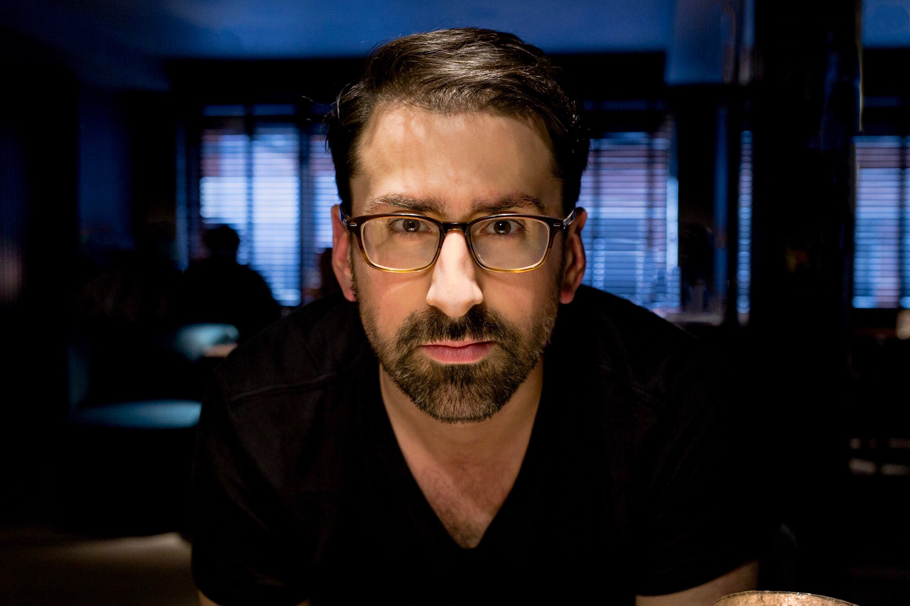

# brandon lucas green

Hey! I’m a product manager & builder, music maker/snob, remote work advocate, writer, husband and DIY enthusiast. I live and work in central Massachusetts with my wife and dog.

I love digging into the deeply human psychology behind how and why people solve problems, and helping to create more solutions to help people.  

> Get in touch: [Email me][1] | [Instagram][2] | [Twitter][3] | [LinkedIn][4]

### What I'm working on
- 🏗️ Product managing @ [Abstract][5]
- 🎹 Composing new music @ [Sophomores][6]
- 🖊️ Writing @ [tone deaf / color blind][7]

*Previously:* [Wayfair][8], [CustomMade][9], [Audiodrops][10], [Sonicbids][11]

### Things I can help with
- Product strategy
- Product discovery & user research
- PM mentorship & coaching
- Remote work culture & process improvement
- Personal productivity & focus

Wanna chat? [Let’s book something][12].

## About this site
This site is a Zettelkasten, a way for me to think and develop ideas out in the open. Other pages on this site:

[[[z:zettels?tag=other]]]

[1]:	mailto:brandonlucasgreen@gmail.com
[2]:	https://instagram.com/brandonlucasgreen
[3]:	https://twitter.com/sphmrs
[4]:	https://linkedin.com/in/brandonlgreen
[5]:	https://abstract.com
[6]:	https://sophomoresmusic.com
[7]:	https://tonedeafcolorblind.com
[8]:	https://wayfair.com
[9]:	https://custommade.com
[10]:	http://drops.nyc/
[11]:	https://sonicbids.com
[12]:	https://calendly.com/brandonlucasgreen/30min
